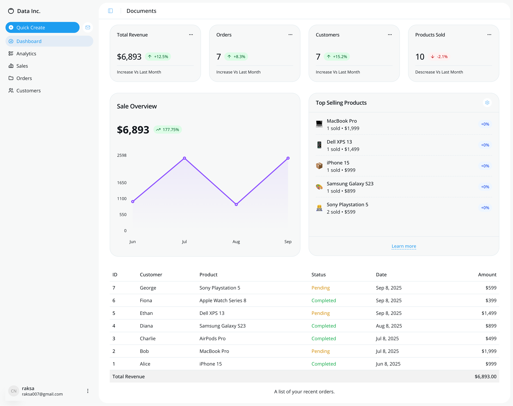

## 📊 Dashboard Preview

s

# 🚀 E-commerce Data Analytic Project

A scalable, production-ready microservice architecture using **FastAPI**, **PostgreSQL**, and **Docker** for building a robust e-commerce data analytic project.

---

## 📦 Tech Stack

- ⚡ **[FastAPI](https://fastapi.tiangolo.com/)** – High-performance Python web framework.
- 🐘 **[PostgreSQL](https://www.postgresql.org/)** – Advanced open-source relational database.
-  **[NextJS](https://nextjs.org/)** – Full-stack React web application framework.
-  **[Shadcn](https://ui.shadcn.com/)** – A set of beautifully designed components that you can customize.
- 🐳 **[Docker](https://www.docker.com/)** – Containerization for easy deployment and scalability.

---

## 📁 Docker compose run
- Make sure you stay in the root directory of the project.

```bash
docker compose build
docker compose up -d
```

## 📁 Run dashboard application

```bash
http://localhost:3000
```

## 📁  API access

```bash
http://localhost:8001/docs
```